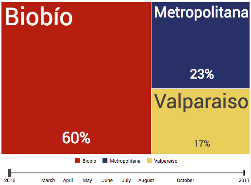

[Volver al índice](general.md)

# Detalles sobre gráficos
Datachile crea y combina visualizaciones interactivas. Por otra parte, piensa los datos como historias y no como archivos.

Es así como la unidad básica de las visualizaciones son los `charts`. Para crear un nuevo `chart`, es necesario entender algunos conceptos previos, y para esto, explicaremos el funcionamiento de dos librerías que fueron usadas de manera intensiva: `mondrian-rest-client` y `d3plus-react`.

## API call y obtención de datos

### `mondrian-rest-client`
Es un cliente javascript para `mondrian-rest`. Actúa como la capa lógica que conecta los cubos de datos con el cliente.

Más detalles de `mondrian-rest-client` en [Github](https://github.com/Datawheel/mondrian-rest-client)

### `datawheel-canon` y el método `need`
La librería `datawheel-canon` incluye el método estático llamado `need`, que permite manipular consultas de manera asincrónica a la API de Datachile. Dentro de cada `need` se realizan queries usando `mondrian-rest-client`. Como resultado de cada query, se genera una URL de forma asincrónica, desde la cuál se obtendrán los datos para el chart.

Para ejemplificar su uso, se muestra una consulta en el cubo `exports`, donde los drilldowns son por Año y País de destino de exportaciones, con una measure de `FOB US`. 

```JSX
import { getLevelObject } from "helpers/dataUtils";
import { Client as MondrianClient } from "mondrian-rest-client";

const client = new MondrianClient(__API__);

class CustomClass extends Section {
  static need = [
    (params, store) => {
      const prm = client.cube("exports").then(cube => {
        var q = 
          cube.query
            .option("parents", true)
            .drilldown("Destination Country", "Country", "Country")
            .drilldown("Date", "Date", "Year")
            .measure("FOB US")
        );

        return {
          key: "product_exports_by_destination",
          data: __API__ + q.path("jsonrecords")
        };
      });

      return {
        type: "GET_DATA",
        promise: prm
      };
    }
  ];
}
```

En caso de resolverse correctamente la `Promise`, se almacenan los resultados en `this.context.data` usando como acceso el nombre dado a la key. 

Usando `product_exports_by_destination` como la key generada por el `need` nos queda: 
```JSX
render() {
  const path = this.context.data.product_exports_by_destination
}
```

En el ejemplo anterior, los datos quedarán disponibles para ser utilizados por los gráficos en la variable `path`.

## Frontend
[D3.js](general.md) es una librería JavaScript para manipular documentos basados en datos. D3 ayuda a contar historias a través de los datos usando HTML, SVG y CSS. Basándose en esta librería, [d3plus.js](http://d3plus.org) es una librería creada por Datawheel LLC para aprovechar el conjunto de características de D3, al tiempo que proporciona una barrera de entrada bastante baja a los usuarios que no conocen de código, diseño o visualización de datos.

### `d3plus-react`
Una de las principales ventajas de d3plus por sobre otra librería, es la posibilidad de utilizar `d3plus-react`, que entrega todas las visualizaciones de d3plus en forma de componentes React. Todas las visualizaciones en Datachile están realizadas usando `d3plus-react`. 

```JSX
import {Treemap} from "d3plus-react";

const config = {
  groupBy: "region",
  data: [
    {region: "Biobío", value: 29, year: 2017},
    {region: "Metropolitana",  value: 10, year: 2017},
    {region: "Valparaiso",  value: 6, year: 2017},
    {region: "Biobío", value: 31, year: 2016},
    {region: "Metropolitana",  value: 12, year: 2016},
    {region: "Valparaiso",  value: 9, year: 2016}
  ],
  size: d => d.value,
  time: "year"
};

<Treemap config={config} />
```



Ver este ejemplo en [JSfiddle](https://jsfiddle.net/252k2gaa/5/)

Más detalles de `d3plus-react` en [Github](https://github.com/d3plus/d3plus-react/)

Más detalles de la documentación de `d3plus` en [Docs](http://d3plus.org/docs/)

### Usando la variable `path`
Como se detalló anteriormente, los datos de cada chart son cargados de forma asíncrona. Para manipular estos datos, en cada chart se genera una variable llamada `path`, que contiene la URL desde la cuál se obtienen los datos para la visualización.

Para manipular el formato de los datos de esta URL, se utiliza la propiedad `dataFormat` de d3plus, que es una función de formato personalizado que se utiliza para formatear datos de una solicitud AJAX. La función pasará los datos brutos devueltos por la solicitud y se espera que devuelva una matriz de valores que serán usados en el chart.

Un ejemplo de esto sería:

```JSX
import {Treemap} from "d3plus-react";

<Treemap
    config={
      {...
        data: path
      }
    }
    dataFormat={data => data.data}
/>
```

*Si se desea preprocesar los datos, esto se debe hacer en `dataFormat`.

**Como sugerencia, no es recomendable usar `this.setState()` dentro de `dataFormat`, debido a que el rendereo de esta propiedad se hace sólo una vez, y no se vuelve a re-renderear si cambia el `state`.

### TreemapStacked
Dentro de Datachile, existen visualizaciones que pueden ser intercambiadas entre `Treemap` y `StackedArea` con el objetivo de visualizar tanto totales como su evolución en el tiempo. Para poder formar esto, se creó el componente `TreemapStacked`, que permite intercambiar de manera simple entre estas dos visualizaciones. 


El único requisito para que este componente funcione correctamente, es que existan datos de dos o más años diferentes.

```JSX

import TreemapStacked from "components/TreemapStacked";

<TreemapStacked
    path={path}
    msrName="Number of visas"
    drilldowns={["Continent", "Country"]}
    depth={true}
    config={{
        ...
        total: d => d["Number of visas"]
        ...
    }}
/>
```

| Propiedad | Tipo | Descripción |
| --- | --- | --- |
| path | `string` | API call desde donde se obtienen los datos para generar la visualización |
| msrName | `string` | Nombre de `measure` |
| drilldowns | `array` | `Array` de `levels` de profundidad que tendrá el `Treemap` |
| depth | `boolean` | Permite aumentar el nivel de profundidad presente en `StackedArea` |
| config | `object` | Añade configuraciones personalizadas al gráfico. |

Si deseas añadir más funcionalidades a este componente, puedes encontrarlo en `app/components/TreemapStacked`.

## Treemap
Su uso está relacionado con el despliegue de datos jerárquicos y por orden de importancia. Es la visualización más usada dentro del website, por su versatilidad y funcionalidad.

Sin embargo, en ningún caso se recomienda su uso si se pretenden filtrar *tuplas* de los datos, dado que se basa en mostrar totales.

```JSX
import {Treemap} from "d3plus-react";

<Treemap config={} />
```

## Bar Chart
Se realizaron comparaciones basándose en:
* Sexo
* Rango Etáreo
* Nivel Geográfico

```JSX
import {BarChart} from "d3plus-react";

<BarChart config={} />
```

## Stacked Area
Si bien el Treemap permite desplegar datos jerárquicos, no es el mejor output para visualizar variación en el tiempo. En caso de requerir lo anterior, `StackedArea` es una buena opción

```JSX
import {StackedArea} from "d3plus-react";

<StackedArea config={} />
```

## Line Plot
Es muy similar al `StackedArea`, dado que busca representar variaciones en el tiempo. En datachile, el uso de `LinePlot` se focalizó en **balances comerciales** (importaciones/exportaciones).

```JSX
import {LinePlot} from "d3plus-react";

<LinePlot config={} />
```

## Scatter Plot
Cuando se poseen tres o más `measures` que pueden ser representadas en un `chart`, se utilizó ScatterPlot, con el objetivo de visualizar con respecto a `x`, `y` y `size`. En datachile sólo se usó en dos casos: ParticipationScatter y PSUNEMScatter, de las secciones Cívica y Educación respectivamente.

```JSX
import {Plot} from "d3plus-react";

<Plot config={
  {
    ...  
    sizeMin: 10,
    sizeMax: 30
  }
} />
```

## Crear un gráfico desde cero
Supongamos que para la sección `Crimes` disponemos de nuevos datos que nos permitirán hacer el gráfico de número de denuncias por sexo. Llamaremos a este chart `CrimesBySex`. Para esto, lo primero que se debe hacer es crear el archivo `CrimesBySex` en `app/pages/GeoProfile/crimes/charts`. (Más detalles de las secciones [aquí](profiles.md))

Dentro de `index.jsx` - en este caso referente a `GeoProfile`- debes importar el chart y además se debe agregar a `need`. Si no se agrega el `chart` a `need`, se obtendrá `undefined` como resultado de la API call.

Para finalizar, puedes agregar el chart donde estimes conveniente en el código. Para escoger el tamaño del `chart`, debes escoger:
* Full-width: `lost-1`
* Medium-width: `lost-1-2`
* 33%-width: `lost-1-3`
* 66%-width: `lost-2-3`

```JSX
import CrimesBySex from "app/pages/GeoProfile/crimes/charts/CrimesBySex";

class GeoProfile extends Component {
  static need = [
    ...
    CrimesBySex
    ...
  ];

  render() {
    ...
    <CrimesBySex className="lost-1" />
  }
}

```