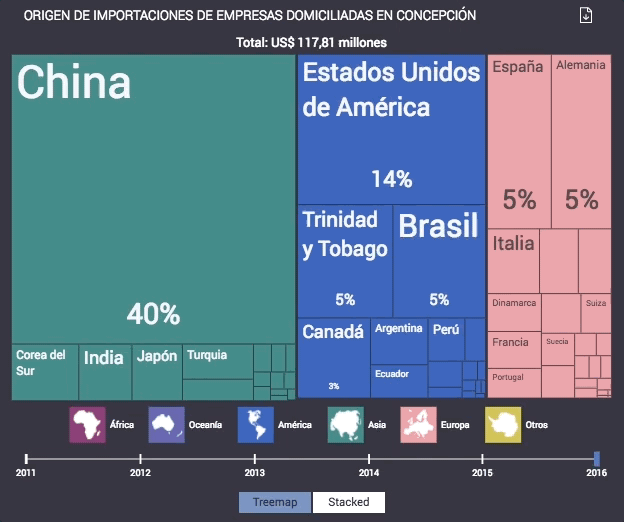

[Volver al índice](general.md)

# Detalles sobre D3Plus - React

## Introducción
[D3.js](general.md) es una librería JavaScript para manipular documentos basados en datos. D3 ayuda a contar a los datos usando HTML, SVG y CSS. Basándose en esta librería, [d3plus.js](http://d3plus.org) es una librería creada por Datawheel LLC para aprovechar el conjunto de características de D3, al tiempo que proporciona una barrera de entrada bastante baja a los usuarios que no conocen DE código, diseño o visualización de datos.

## D3Plus React
Una de las principales ventajas de d3plus por sobre otra librería, es la posibilidad de utilizar `d3plus-react`, que entrega todas las visualizaciones de d3plus en forma de componentes React.

```JSX
import {Treemap} from "d3plus-react";

const config = {
  groupBy: "region",
  data: [
    {region: "Biobío", value: 29, year: 2017},
    {region: "Metropolitana",  value: 10, year: 2017},
    {region: "Valparaiso",  value: 6, year: 2017},
    {region: "Biobío", value: 31, year: 2016},
    {region: "Metropolitana",  value: 12, year: 2016},
    {region: "Valparaiso",  value: 9, year: 2016}
  ],
  size: d => d.value,
  time: "year"
};

<Treemap config={config} />
```

Más detalles de `d3plus-react` en [Github](https://github.com/d3plus/d3plus-react/)
Más detalles de la documentación de `d3plus` en [Docs](http://d3plus.org/docs/)

## Utilización en Datachile
Todas las visualizaciones en Datachile están realizadas usando `d3plus-react`. 


## TreemapStacked
Dentro de Datachile, existen visualizaciones que pueden ser intercambiadas entre `Treemap` y `StackedArea` con el objetivo de visualizar tanto totales como su evolución en el tiempo. Para poder formar esto, se creó el componente `TreemapStacked`, que permite intercambiar de manera simple entre estas dos visualizaciones. 



El único requisito para que este componente funcione correctamente, es que existan datos de dos o más años diferentes.

```JSX

import TreemapStacked from "components/TreemapStacked";

<TreemapStacked
    path={path}
    msrName="Number of visas"
    drilldowns={["Continent", "Country"]}
    depth={true}
    config={{
        ...
        total: d => d["Number of visas"],
        totalConfig: {
            text: d =>
                "Total: " +
                numeral(getNumberFromTotalString(d.text), locale).format(
                    "0,0"
                ) +
                " " +
                t("visas")
        }
        ...
    }}
/>
```

| Propiedad | Tipo | Descripción |
| --- | --- | --- |
| path | `string` | List all new or modified files |
| msrName | `string` | Nombre de `measure` que será usada |
| drilldowns | `array` | `Array` de `levels` de profundidad que tendrá el `Treemap` |
| depth | `boolean` | Genera el nivel de detalles presente en `StackedArea` |
| config | `object` | Añade configuraciones personalizadas al gráfico. |